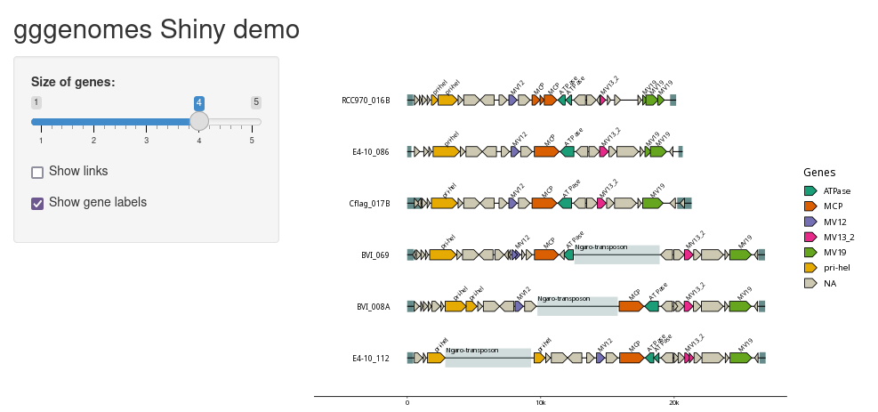

# Shiny(live) demo for gggenomes

A basic example how to use [`gggenomes`](https://thackl.github.io/gggenomes/)
interactively with [`shiny`](https://shiny.posit.co/) or
[`shinylive`](https://posit-dev.github.io/r-shinylive/).



This is an experiment to demonstrate how `gggenomes` can be used interactively,
however performance (particularly for `shinylive`) is not ideal in this example.

## Shinylive

Visit [the website](https://biomeds.github.io/shiny-gggenomes/site/).

If you make changes locally, you can re-export via

```R
shinylive::export(".", "site")
```

## Shiny

Run locally via

```R
shiny::runGitHub("shiny-gggenomes","BioMeDS")
```

